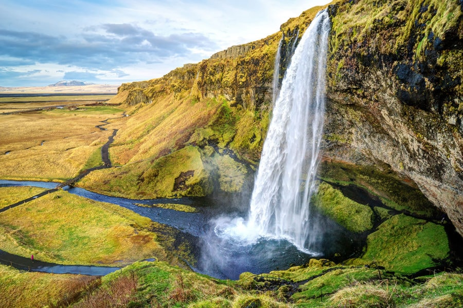

# Day 56: 🌍 Wanderlust Adventures Webpage 🚀

Create a modern, visually engaging **travel blog-style webpage** using the sleek **Massively** template by HTML5 UP. This project features dynamic layout sections, beautiful imagery, and clean navigation for sharing travel stories and tips with style.

## 🌟 Overview

The **Wanderlust Adventures** webpage highlights exotic destinations and offers essential travel tips. Built with HTML, CSS, and Flask, it provides a structured and aesthetic experience using a responsive template.

## 🚧 How It Works

1. **Home Page**: Features a bold hero section, featured travel stories, and a clean article grid.
2. **Tips Page**: Offers travel hacks and safety advice.
3. **Navigation Bar**: Seamless top navigation with social icons.
4. **Flask Routing**: Dynamically serves `index.html` and `tips.html`.

## 🖼️ Example Preview

```html
<h1>Wanderlust Adventures</h1>
<p>Explore stunning destinations, travel tips, and epic journeys around the world 🌍</p>
```



## 💡 Features

* 🖼️ Stunning responsive layout
* 🌐 Social media integration
* 🧭 Google Fonts & Font Awesome
* 📱 Mobile-ready design
* 🧭 Flask server for local development

## 🛠️ How to Use

1. **Clone the project:**

   ```bash
   git clone https://github.com/thupham96/100-python-projects.git
   cd Day56_WanderlustWebpage
   ```

2. **Install Flask:**

   ```bash
   pip install flask
   ```

3. **Run the app:**

   ```bash
   python main.py
   ```

4. **Access in your browser:**

   Visit `http://127.0.0.1:5000/`

## 📂 Project Structure

```
Day56_WanderlustWebpage/
├── main.py
├── templates/
│   ├── index.html
│   └── tips.html
├── static/
│   ├── assets/css/
│   │   ├── main.css
│   │   └── noscript.css
│   ├── images/
│   │   └── [bali.jpg, iceland.jpg, etc.]
│   └── fontawesome-all.min.css
```

## 🧰 Technologies Used

* HTML5 + CSS3
* JavaScript (HTML5 UP’s plugins)
* Flask (Python)
* Font Awesome
* Google Fonts
* HTML5 UP's [Massively](https://html5up.net/massively)

## 🧠 What I Learned

* Adapting and customizing professional templates
* Structuring Flask apps to serve HTML content
* Managing static assets and routing
* Enhancing visual storytelling with responsive layouts

---

🌐 Take your travel stories to the web with flair — one destination at a time! ✈️📸
